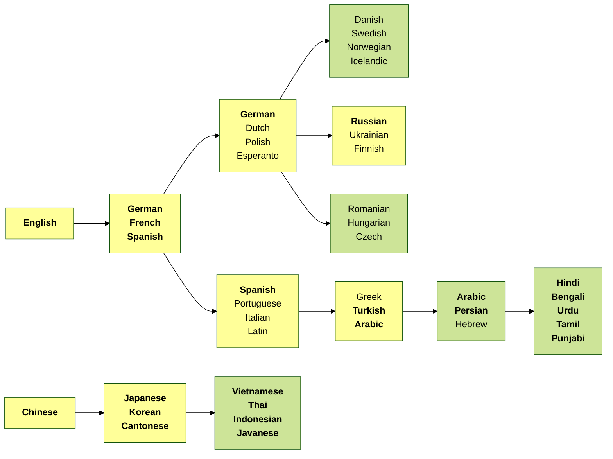

Notes:

* **Bold** languages are among top 40 by total number of speakers according to wikipedia: https://en.wikipedia.org/wiki/List_of_languages_by_total_number_of_speakers
* Reference: https://www.theguardian.com/education/gallery/2015/jan/23/a-language-family-tree-in-pictures
